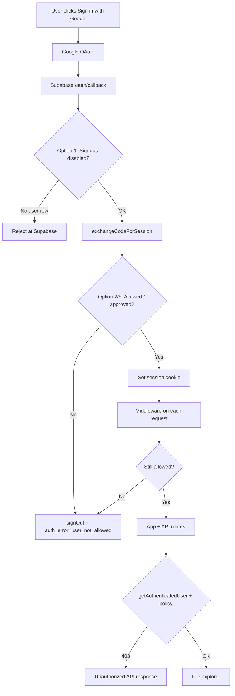

# Restricting Login While Registration Is Open in Supabase

This document describes options for controlling **who can log in** to the S3 File Explorer, even when Supabase Auth allows new user signups (e.g. via Google OAuth).

The app currently uses **Google OAuth** through Supabase. The login UI already states that only pre-configured users may access the app (`components/auth-view.tsx`), and auth errors map disallowed users to the `user_not_allowed` code (`lib/auth-error-messages.ts`). **Enforcement** depends on which option you choose below.

---

## Quick comparison

| Approach | Code changes | Where enforced | Best for |
|----------|--------------|----------------|----------|
| [1. Disable signups](#1-disable-signups-in-supabase-simplest) | None | Supabase Auth | Small fixed team, manual provisioning |
| [2. Email allowlist in app](#2-email-allowlist-table--app-checks) | Medium | Callback, middleware, API | Add/remove users by email over time |
| [3. Supabase Auth Hook](#3-supabase-before-user-created-hook) | Edge Function + config | Supabase (before user row exists) | Strict gate; no orphan accounts |
| [4. Google OAuth restrictions](#4-restrict-at-google-oauth) | Small (optional `hd` param) | Google + one of the above | Single Google Workspace org |
| [5. Approval workflow](#5-approval-workflow-register-now-access-later) | Medium–high | Database RLS + app UI | Self-registration with admin approval |

---

## Current app touchpoints

When implementing any option that checks access in the app (options 2 and 5), enforce at **all three** layers:

| Layer | File | Role today |
|-------|------|------------|
| OAuth callback | `app/auth/callback/route.ts` | Exchanges code for session; **no allowlist check yet** |
| Middleware | `middleware.ts` → `lib/supabase/middleware.ts` | Refreshes session; **does not block disallowed users** |
| API routes | `lib/api-auth.ts` → `getAuthenticatedUser()` | Returns user if session valid; **does not check approval/allowlist** |

Client-side checks alone are not enough — API routes and middleware must match.

---

## 1. Disable signups in Supabase (simplest)

### How it works

In the Supabase Dashboard:

**Authentication → Settings** (or provider settings) → disable **“Allow new users to sign up”**.

- Users already in `auth.users` can sign in with Google OAuth.
- Unknown Google accounts are rejected by Supabase before a session is created.
- Your app already surfaces this as `user_not_allowed` when Supabase returns signup/not-authorized errors.

### Provisioning users

1. **Authentication → Users → Add user**
2. Enter the **same email** as their Google account (password can be unused for OAuth-only users).
3. User signs in with **Sign in with Google**.

### Pros

- No application code changes.
- Enforced entirely by Supabase; no session is issued to unauthorized users.

### Cons

- Manual user management in the dashboard.
- No self-service registration or invite links without changing approach.

### When to choose

Fixed small team; you are fine adding each person manually in Supabase.

---

## 2. Email allowlist table + app checks

### How it works

Keep signups enabled in Supabase. Maintain an `allowed_users` table. After OAuth succeeds, verify the user’s email against the table. If not allowed, sign out and redirect with `auth_error=user_not_allowed`.

### Database

```sql
CREATE TABLE allowed_users (
  email TEXT PRIMARY KEY,
  created_at TIMESTAMPTZ DEFAULT now()
);

-- Example seed
INSERT INTO allowed_users (email) VALUES ('alice@example.com');

-- Optional: only service role / admin can modify
ALTER TABLE allowed_users ENABLE ROW LEVEL SECURITY;
-- No policies for anon/authenticated → only service role can read/write
```

Use a **service role** Supabase client (server-only, never exposed to the browser) to query this table.

### Implementation checklist

- [ ] **`app/auth/callback/route.ts`** — After `exchangeCodeForSession`, read `session.user.email`, query `allowed_users`. If missing: `supabase.auth.signOut()`, redirect to `/?auth_error=user_not_allowed`.
- [ ] **`lib/supabase/middleware.ts`** (or `middleware.ts`) — On each request, if user is logged in but email not in allowlist, sign out and redirect to login.
- [ ] **`lib/api-auth.ts`** — Add `getAuthenticatedAllowedUser()` (or extend `getAuthenticatedUser`) that returns 403 when email is not allowlisted.
- [ ] **Admin process** — Document how you add/remove rows (SQL editor, small admin script, or Supabase dashboard).

### Optional: domain allowlist instead of per-email

Same pattern, but allow any `@yourcompany.com`:

```sql
CREATE TABLE allowed_domains (
  domain TEXT PRIMARY KEY  -- e.g. 'yourcompany.com'
);
```

Check: `email.split('@')[1]` is in `allowed_domains`.

### Pros

- Flexible: add users without touching Supabase Auth settings.
- Works with open OAuth registration.
- Fits existing `user_not_allowed` UX.

### Cons

- Unauthorized users may briefly get a session until callback/middleware runs (mitigate with callback as first gate).
- Orphan rows in `auth.users` for people who OAuth but fail the allowlist (unless combined with option 3 or periodic cleanup).

### When to choose

You want a simple email list you control in your own database.

---

## 3. Supabase “Before User Created” hook

### How it works

Supabase runs an [Auth Hook](https://supabase.com/docs/guides/auth/auth-hooks/before-user-created-hook) **before** inserting a row into `auth.users`. The hook can reject signup so unauthorized emails never become users.

Typical flow:

1. Deploy a Supabase Edge Function.
2. Hook receives pending user (email, provider metadata).
3. Compare email against allowlist (Postgres query or env var list).
4. Throw / return error if not allowed → OAuth fails at Supabase.

Example sketch (Edge Function):

```typescript
// Pseudocode — adapt to Supabase hook payload format
const email = user.email?.toLowerCase();
const allowed = await isEmailAllowed(email); // query allowed_users table
if (!allowed) {
  return new Response(JSON.stringify({ error: { message: 'User not allowed', http_code: 403 } }), { status: 403 });
}
return new Response(JSON.stringify({}), { status: 200 });
```

Configure in **Authentication → Hooks → Before user created**.

### Pros

- Strongest Supabase-native gate: no `auth.users` row for rejected users.
- Centralized policy; app code can stay simpler (still recommend API checks for defense in depth).

### Cons

- Requires Edge Function deployment and dashboard hook wiring.
- Debugging is in Supabase logs, not only Next.js.

### When to choose

Registration stays open, but you must never create auth records for strangers.

---

## 4. Restrict at Google OAuth

### How it works

Limit who can complete Google sign-in at the identity provider.

**Google Cloud Console → APIs & Services → OAuth consent screen:**

| Setting | Effect |
|---------|--------|
| **User type: Internal** | Only accounts in your Google Workspace organization (requires Workspace). |
| **Testing + Test users** | Only listed Google accounts can sign in while app is in testing mode. |

Optional UX hint in `components/auth-view.tsx` (not security by itself):

```typescript
await supabase.auth.signInWithOAuth({
  provider: 'google',
  options: {
    redirectTo: `${window.location.origin}/auth/callback`,
    queryParams: { hd: 'yourcompany.com' }, // hosted domain hint
  },
});
```

The `hd` parameter pre-selects a domain in the Google account picker; **always pair with option 1, 2, or 3** for real enforcement.

### Pros

- Good for single-org deployments.
- Little or no app logic if Internal / test users is sufficient.

### Cons

- Tied to Google; not portable to other providers.
- `hd` alone can be bypassed; Internal mode requires Google Workspace.

### When to choose

Everyone uses the same Google Workspace domain.

---

## 5. Approval workflow (register now, access later)

### How it works

Allow anyone to create a Supabase account via OAuth, but gate **application data** until an admin approves them.

### Database

```sql
CREATE TABLE profiles (
  id UUID PRIMARY KEY REFERENCES auth.users(id) ON DELETE CASCADE,
  email TEXT NOT NULL,
  approved BOOLEAN NOT NULL DEFAULT false,
  created_at TIMESTAMPTZ DEFAULT now()
);

-- Trigger: create profile on signup
CREATE OR REPLACE FUNCTION public.handle_new_user()
RETURNS TRIGGER AS $$
BEGIN
  INSERT INTO public.profiles (id, email)
  VALUES (NEW.id, NEW.email);
  RETURN NEW;
END;
$$ LANGUAGE plpgsql SECURITY DEFINER;

CREATE TRIGGER on_auth_user_created
  AFTER INSERT ON auth.users
  FOR EACH ROW EXECUTE FUNCTION public.handle_new_user();

-- RLS: users can read own profile; only approved users touch S3 config
ALTER TABLE profiles ENABLE ROW LEVEL SECURITY;
ALTER TABLE user_s3_configs ENABLE ROW LEVEL SECURITY;

CREATE POLICY "Users read own profile"
  ON profiles FOR SELECT USING (auth.uid() = id);

CREATE POLICY "Approved users access own S3 config"
  ON user_s3_configs FOR ALL
  USING (
    auth.uid() = user_id
    AND EXISTS (
      SELECT 1 FROM profiles p
      WHERE p.id = auth.uid() AND p.approved = true
    )
  );
```

### App behavior

- Logged-in but `approved = false` → show **“Pending approval”** screen (not the file explorer).
- **`lib/api-auth.ts`** — Return 403 if profile not approved.
- Admin approves via SQL: `UPDATE profiles SET approved = true WHERE email = '...';` (or a future admin UI).

### Pros

- Self-registration with human review.
- Clear audit trail (`profiles` table).

### Cons

- Unauthorized users still exist in `auth.users` and hold a session.
- Must block UI, APIs, and RLS consistently.
- More moving parts than a simple allowlist.

### When to choose

You expect unknown people to sign up and want to approve them after the fact.

---

## Recommended combinations

| Scenario | Recommendation |
|----------|----------------|
| Personal / small team tool | **Option 1** — disable signups, pre-create users |
| Invite colleagues by email | **Option 2** — allowlist table + callback/middleware/API |
| Public OAuth, zero stray auth users | **Option 3** — Auth hook (+ option 2 for app-layer checks) |
| Company on Google Workspace | **Option 4 (Internal)** + **Option 1** or **2** |
| Waitlist / manual approval | **Option 5** |

---

## Defense in depth (any app-side option)



Minimum app changes for options 2 and 5:

1. **`app/auth/callback/route.ts`** — first gate after session creation  
2. **`lib/supabase/middleware.ts`** — ongoing session validation  
3. **`lib/api-auth.ts`** — protect `/api/s3-config` and other routes  

Existing error handling in `lib/auth-error-messages.ts` already supports `user_not_allowed` messaging.

---

## Environment variables (option 2 variant)

If you prefer env-based allowlist without a table (small teams only):

```env
# Server-only — comma-separated
ALLOWED_LOGIN_EMAILS=alice@example.com,bob@example.com
```

Or:

```env
ALLOWED_LOGIN_DOMAIN=yourcompany.com
```

Parse in a shared server module (e.g. `lib/allowed-users.ts`) used by callback, middleware, and `api-auth.ts`. **Do not** use `NEXT_PUBLIC_` prefix for allowlists.

For production with many users, prefer the **database table** so you can update access without redeploying.

---

## Decision record (fill in when you choose)

| Field | Your choice |
|-------|-------------|
| Selected option | |
| Signups enabled in Supabase? | |
| Who provisions users? | |
| Enforcement layers implemented | ☐ callback ☐ middleware ☐ api-auth ☐ RLS |
| Date decided | |

---

## References

- [Supabase Auth Hooks — Before user created](https://supabase.com/docs/guides/auth/auth-hooks/before-user-created-hook)
- [Supabase — Disable signups](https://supabase.com/docs/guides/auth/general-configuration)
- App files: `components/auth-view.tsx`, `app/auth/callback/route.ts`, `lib/api-auth.ts`, `lib/auth-error-messages.ts`
